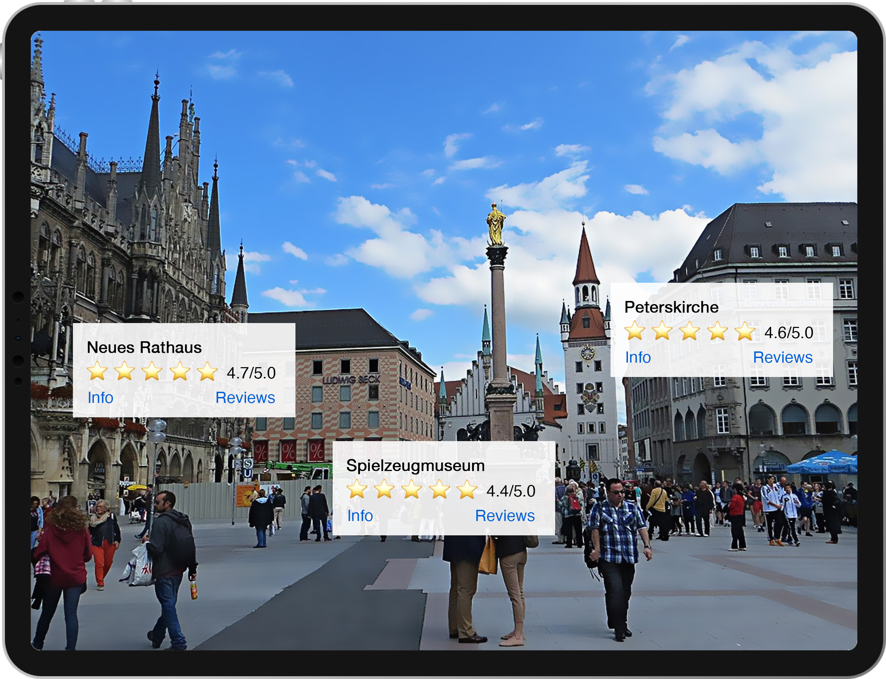

# mingAR
A unique experience of discovering the city of Minga ❤️

## About
### How do we discover a new City?
* Guided Walking Tours 
* Google Maps
* Reviewsites e.g. TripAdvisor 
* Facebook
* Friends

### The Problem
Its NOT you! Discovering through the lens of other people limits your experience. Let your own curiosity drive you! Walk around in your own pace and pay attention to your surroundings.

> There are often some hundred times, a thousand times, before you can really see it for the first
time
> - Christian Morgenstern, Munich

### Solution

mingAR shows in AR points of interest around you, allowing you to quickly understand what do you want to visit next. You can see your location on a map and choose the best destinations there and then find them using AR or just open the AR view and see all POIs you can visit. You are interested what this place or building is about? Just open the mingAR app and you will get a description and all information about it!

Our application also allows the user to collect achievements, accomplish goals and compete with other users. For example, you can collect points for visiting certain places and get beautiful badges for successfully completing the challenges.

### Functionality
* Visit Points of Interests (e.g Landmarks, buildings, sights)
* Discover additional Information about the Poi’s with our exceptional ARview
* Leave your notes on the buildings for the next guest to discover or write some historic facts that only a true local can know
* Complete Challenges to get Points for the Leaderboard and win prizes like a beer at the Hofbräuhaus
* Make a walking tour in your own pace, with our predefined themed Tours (e.g Street Art, Royals, Historic Landmarks, Munich during the Nazitime)

### Used tools
* Apple ARKit and SceneKit
* Node.js
* Real data from [Open-Data-Portal München](https://www.opengov-muenchen.de)

### Targetgroup
* Tourists on vacation
* Munich locals who want to discover their home more deeply
* Family and friends as a scavenger hunt competion

### What's next for mingAR
Introduction of more data sources, more detailed description of the specific location, more realistic 3D models, as well as introduction of new gamification elements.

## Usage
This is an open source project, so you need to perform intallation manually. 

### For client:

1. Go to `source/client`
2. Open `hackaTUM.xcworkspace` with Xcode. 
3. Run project on your **real** device.

### For server:

1. Go to `source/server`
2. Get docker container running: `cd server && docker-compose up -d`
3. Sync schema: `ts-node ./node_modules/typeorm/cli.js schema:sync`

### Credits
Dan Bachar, Artem Evdokimov, Daniel Gloukhman, Łukasz Zalewski
